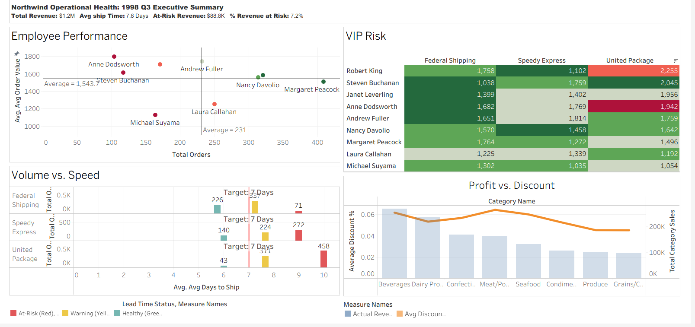

# Northwind Operational Analysis: Recovering $88.8K at Risk
This project identifies a 7.2% revenue leak ($88.8K) caused by logistics bottlenecks and excessive discounting in premium categories.

## 🛠️ Data Pipeline
1. **Extraction (SQL):** Extracted 3,000+ records from the Northwind database using complex JOINs to link logistics performance with sales talent.
2. **Transformation (Excel):** Used as a staging layer for final data cleaning, currency standardization, and RFM calculation before visualization.
3. **Visualization (Tableau):** Designed an executive-level dashboard to identify the $88.8K revenue leak.

## 📈 Key Insights
1. **The Logistics Bottleneck:** 458 orders are stuck in a 10-day delay loop with United Package.
2. **The Discount Trap:** Meat/Poultry discounts (6.45%) are eroding margins compared to Beverages.

## 📊 Dashboard Preview

## 📂 Project Structure
- [SQL Scripts](/SQL): Logic used to calculate churn and shipping delays.
- [Executive Presentation](/Documentation): Full 10-slide deck for the board.

## 💡 Strategic Recommendations
- **Logistics:** Shift high-value orders (>$1,800) to Federal Shipping to reduce lead time by 4 days.
- **Pricing:** Cap Meat/Poultry discounts at 5.5% to recover $45K in lost margin.

Google Drive folder:
[📁 View Project Assets (PowerPoint & Tableau files & Word Logs)](https://drive.google.com/drive/folders/1CFXFY58VXuMOi2tlM_00CS3he5MqFbCS?usp=sharing)
